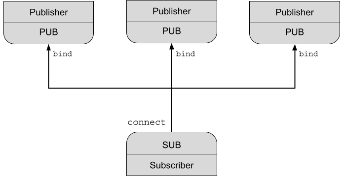

# Publish-Subscribe

Publish-Subscribe (Pub/Sub) is a pattern where senders of messages, called publishers, send messages without knowledge of the receivers, called subscribers.  The Publish/Subscribe pattern is akin to a radio station (publisher) broadcasting on a specific frequency (port) where any number of listeners (subscribers) may tune in and listen. 

Pub/Sub communication is asynchronous. If a “publish” service is started before a “subscribe” service, then the subscriber would not receive messages that were already published by the publisher. Starting a “publisher” and a“subscriber” are independent of each other. 

## Multiple Subscribers
There are two commons scenarios for a Publish/Subscribe pattern.  The first scenario has multiple subscribers listening to a publisher.  The publisher does not know about the subscribers and messages are published with or without any sunscribers listening.  


Publishers are created with `Socket(PUB)` socket type. 
### zmq_pub.jl
```julia
using ZMQ

tcp = "tcp://*:5554"
ctx = Context()
pub = Socket(ctx, PUB)
bind(pub, tcp)

while true
    msg = "aaa"
    send(pub, Message(msg))
    println("Publish: ", msg)
    sleep(0.5)

end
close(pub)
```

Subscribers are created with `Socket(SUB)` socket type. 
### zmq_sub.jl
```julia
using ZMQ

tcp = "tcp://localhost:5554"
ctx = Context()
sub = Socket(ctx, SUB)
connect(sub, tcp)
subscribe(sub)

while true
    msg = recv(sub, String)
    println("Receive: ", msg)
end
close(sub)
```
A publisher publishes `"aaa"` with two subscribers connected. 


## Multiple Publishers
The second scenario has a subscriber connected to multiple publishers.  The messages from both publishers arrive at the subscriber interleaved.  


### publisher_1.jl
```julia
using ZMQ

tcp = "tcp://*:5554"
ctx = Context()
pub = Socket(ctx, PUB)
bind(pub, tcp)

while true
    msg = "aaa"
    send(pub, Message(msg))
    println("Publish: ", msg)
    sleep(0.5)

end
close(pub)
```

### publisher_2.jl
```julia
using ZMQ

tcp = "tcp://*:5553"
ctx = Context()
pub = Socket(ctx, PUB)
bind(pub, tcp)

while true
    msg = "bbb"
    send(pub, Message(msg))
    println("Publish: ", msg)
    sleep(0.5)

end
close(pub)
```

### subscriber.jl
```julia
using ZMQ

tcp1 = "tcp://localhost:5554"
tcp2 = "tcp://localhost:5553"
ctx = Context()
sub = Socket(ctx, SUB)
connect(sub, tcp1)
connect(sub, tcp2)
subscribe(sub)

while true
    msg = recv(sub, String)
    println("Receive: ", msg)
end
close(sub)
```

Publisher 1 publishes `"aaa"` while publisher 2 publishes `"bbb"`.  The subscriber is connected to both publishers and the messages arrived interleaved.  


## Notes

- If a publisher has no connected subscribers, then it will simply drop all messages.
- If using a TCP socket, and a subscriber is slow, messages will queue up on the publisher.
- Filtering happens at the subscriber side, not the publisher side.
